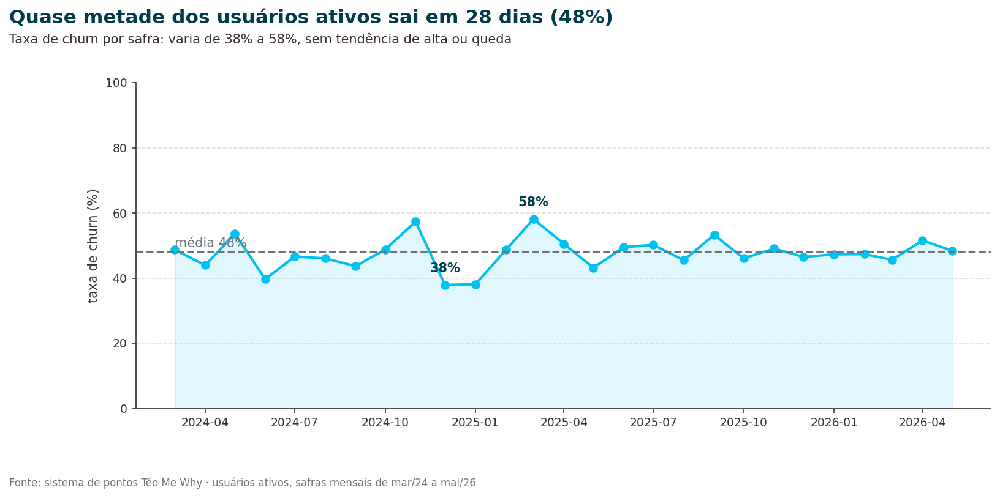
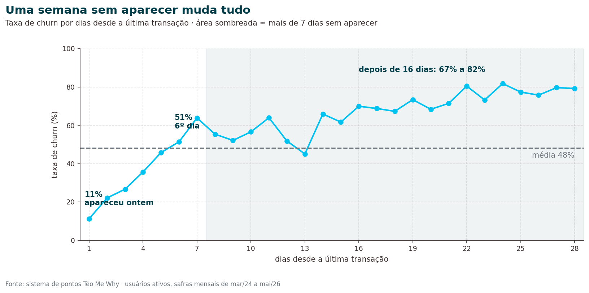
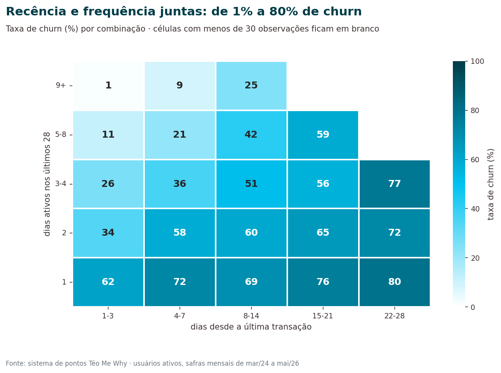
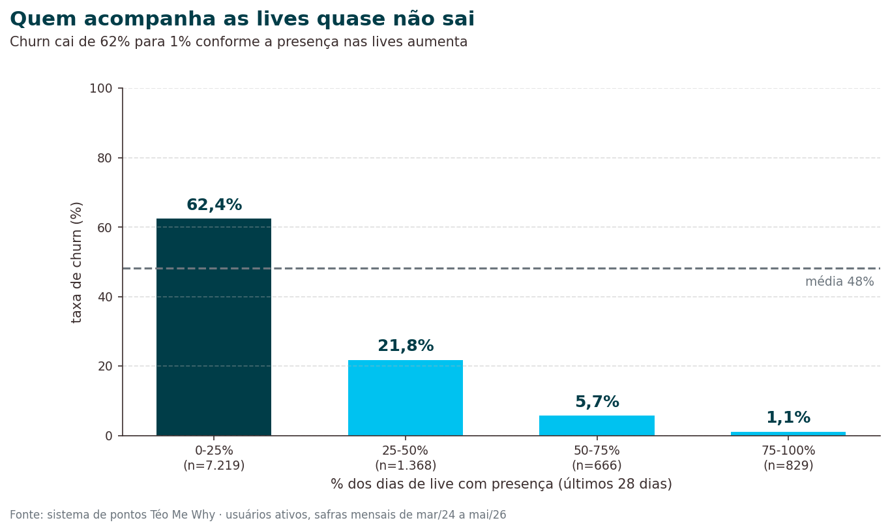
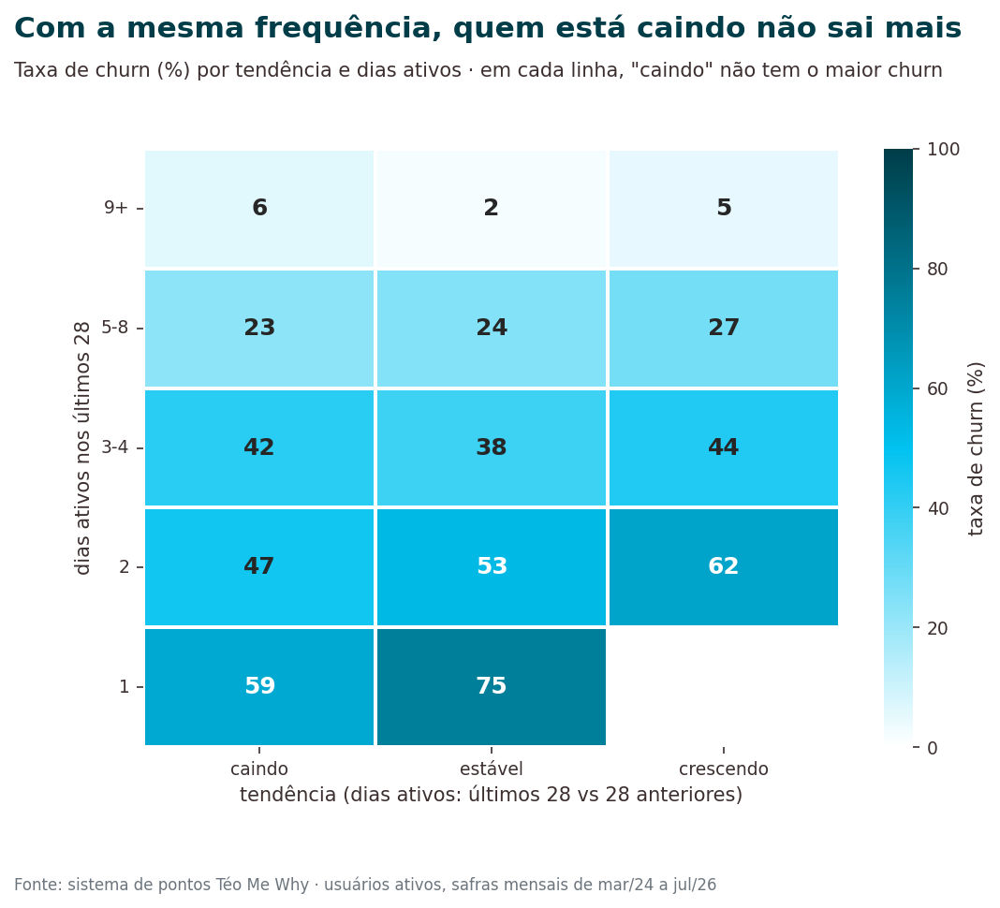

<h1 align="center">Churn na comunidade Téo Me Why</h1>

  <b>Quem vai deixar de participar da comunidade nos próximos 28 dias, e por quê?</b> 
  Análise de churn com dados reais do sistema de pontos de uma comunidade de dados na Twitch.

  
  
  
  
  
  

  <a href="#resumo">Resumo</a> •
  <a href="#quadro">Quadro resumo</a> •
  <a href="#problema">Problema</a> •
  <a href="#achados">Achados</a> •
  <a href="#recomendacoes">Recomendações</a> •
  <a href="#abordagem">Abordagem</a> •
  <a href="#notebooks">Notebooks</a> •
  <a href="#reproduzir">Reproduzir</a>

<table align="center">
  <tr>
    <td align="center" width="33%"><h2>47,9%</h2>dos usuários ativos saem em 28 dias</td>
    <td align="center" width="33%"><h2>62% → 1%</h2>de churn conforme a presença nas lives aumenta</td>
    <td align="center" width="33%"><h2>6º dia</h2>sem aparecer: o churn chega a 50%</td>
  </tr>
</table>

<h2>📌 Resumo</h2>

<ul>
  <li><b>Problema:</b> quase metade dos usuários ativos da comunidade deixa de participar a cada mês, e a base ativa encolheu de cerca de 675 para cerca de 250 usuários por mês entre 2024 e 2026.</li>
  <li><b>Abordagem:</b> 352 mil transações do sistema de pontos e 43 mil episódios da plataforma de cursos transformados em uma base analítica mensal (usuário × mês). 12 hipóteses, organizadas em 8 blocos de comportamento, foram testadas com a taxa de churn por faixa.</li>
  <li><b>Resultado:</b> os sinais mais fortes são a <b>presença nas lives</b>, a <b>recência</b> e a <b>frequência</b>. Vínculo (streak, variedade de interação, uso da loja, histórico de cursos) também protege. A tendência de queda na atividade <b>não</b> explica o churn.</li>
  <li><b>Próximo passo:</b> modelo de classificação para listar os 50 usuários com maior probabilidade de churn.</li>
</ul>

<h2>🧩 Quadro resumo: hipóteses e features</h2>

12 hipóteses, organizadas em 8 blocos de comportamento. A tabela completa está na seção 11 do <a href="03_eda.ipynb"><code>03_eda</code></a>.

<table>
  <tr>
    <th align="left">Bloco</th>
    <th align="left">Hipótese</th>
    <th align="left">Resultado</th>
    <th align="left">Feature</th>
  </tr>
  <tr>
    <td><b>A. Perfil</b></td>
    <td>Novatos saem mais</td>
    <td>⚠️ Pico entre o 15º e o 28º dia (69%)</td>
    <td><code>diasDesdePrimeira</code>, <code>flNovatoRisco</code></td>
  </tr>
  <tr>
    <td rowspan="3"><b>B. Volume</b></td>
    <td>Dias sem aparecer aumentam o churn</td>
    <td>✅ 11% → 67–82%</td>
    <td><code>recencia</code></td>
  </tr>
  <tr>
    <td>Mais dias ativos, menos churn</td>
    <td>✅ 1% a 80% na matriz RF</td>
    <td><code>diasAtivosD14</code>, <code>diasAtivosD28</code>, <code>diasAtivosD56</code></td>
  </tr>
  <tr>
    <td>Mais intensidade por dia, menos churn</td>
    <td>✅ 68% → 34%</td>
    <td><code>transacoesPorDiaD28</code>, <code>horasPorDiaD28</code></td>
  </tr>
  <tr>
    <td><b>C. Tendência</b></td>
    <td>Queda de atividade antecede o churn</td>
    <td>❌ Some ao controlar a frequência</td>
    <td>—</td>
  </tr>
  <tr>
    <td><b>D. Mix</b></td>
    <td>Variedade de interação indica engajamento</td>
    <td>✅ 13% vs 67%</td>
    <td><code>qtdProdutosDistintos</code></td>
  </tr>
  <tr>
    <td rowspan="2"><b>E. Hábito</b></td>
    <td>Streak cria hábito</td>
    <td>✅ 11% vs 54%</td>
    <td><code>fezStreak</code></td>
  </tr>
  <tr>
    <td>Quem já voltou antes se comporta diferente</td>
    <td>❌ Sem separação clara</td>
    <td>—</td>
  </tr>
  <tr>
    <td rowspan="2"><b>F. Comunidade</b></td>
    <td>Presença nas lives indica vínculo</td>
    <td>✅ 62% → 1%</td>
    <td><code>pctLivesPresente</code></td>
  </tr>
  <tr>
    <td>Lives perdidas medem recência melhor que dias</td>
    <td>✅ 14% → 76%</td>
    <td><code>livesPerdidas</code></td>
  </tr>
  <tr>
    <td><b>G. Loja</b></td>
    <td>Gastar pontos indica objetivo</td>
    <td>✅ 14% vs 51%</td>
    <td><code>gastouD28</code></td>
  </tr>
 <tr>
    <td><b>H. Educação</b></td>
    <td>Quem estuda na plataforma sai menos</td>
    <td>❌ Estudo recente não protege (49% vs 50%); quem já estudou e parou sai menos (38%)</td>
    <td><code>flFezCurso</code>, <code>diasDesdeUltimoEp</code></td>
  </tr>
  </table>

<h2>🎯 Problema de negócio</h2>

A comunidade Téo Me Why premia a participação nas lives com pontos: mensagens no chat, lista de presença, streaks e resgates na loja. Um usuário que para de interagir é um usuário que deixa de assistir, de participar e de indicar a comunidade.

<b>KPI:</b> taxa de churn em 28 dias, ou seja, a porcentagem dos usuários ativos no mês que não fazem nenhuma interação nos 28 dias seguintes.

<b>Perguntas:</b>

<ol>
  <li>Quais características explicam melhor o churn nos próximos 28 dias?</li>
  <li>Quem são os 50 usuários com maior probabilidade de churn, com as probabilidades associadas?</li>
</ol>

<blockquote>
  
ℹ️ Esta versão responde à pergunta 1. A pergunta 2 vem com a etapa de modelagem.

</blockquote>

<h2>📊 Principais achados</h2>

<h3>1. Quase metade dos usuários ativos sai em 28 dias</h3>

O churn médio é de <b>47,9%</b> e varia entre 38% e 58% por mês, sem tendência de alta ou de queda. O problema é estrutural, e não de um período específico.

  
<b>📈 Ver gráfico</b>

   
  

    
  

<h3>2. Uma semana sem aparecer muda tudo</h3>

Quem apareceu ontem tem <b>11%</b> de churn. No 6º dia sem aparecer, <b>50%</b>. Depois de duas semanas, entre <b>67% e 82%</b>. A janela para agir é curta.

  
<b>📈 Ver gráfico</b>

   
  

    
  

<h3>3. Recência e frequência se somam</h3>

Combinando as duas, o risco vai de <b>1%</b> (9+ dias ativos e visto nos últimos 3 dias) a <b>80%</b> (1 dia ativo e sumido há mais de 3 semanas).

  
<b>📈 Ver gráfico</b>

   
  

    
  

<h3>4. Quem acompanha as lives quase não sai</h3>

É o sinal mais forte da análise: o churn cai de <b>62%</b> (presença em menos de 25% das lives) para <b>1%</b> (presença em mais de 75%).

  
<b>📈 Ver gráfico</b>

   
  

    
  

<h3>5. Vínculo protege</h3>
<table>
  <tr>
    <th align="left">Sinal</th>
    <th align="center">Churn com o sinal</th>
    <th align="center">Churn sem o sinal</th>
  </tr>
  <tr>
    <td>Fez streak de presença nos últimos 28 dias</td>
    <td align="center"><b>11%</b></td>
    <td align="center">54%</td>
  </tr>
  <tr>
    <td>Usou 3 ou mais tipos de interação</td>
    <td align="center"><b>13%</b></td>
    <td align="center">67% (1 tipo)</td>
  </tr>
  <tr>
    <td>Gastou pontos na loja</td>
    <td align="center"><b>14%</b></td>
    <td align="center">51%</td>
  </tr>
  <tr>
    <td>Mais transações por dia ativo (maior vs menor quartil)</td>
    <td align="center"><b>34%</b></td>
    <td align="center">68%</td>
  </tr>
    <tr>
    <td>Já fez curso na plataforma, mas parou (desde mar/2025)</td>
    <td align="center"><b>38%</b></td>
    <td align="center">50% (nunca fez)</td>
  </tr>
</table>

Estudar <b>agora</b> não reduz o churn (49%, igual a quem nunca fez curso). Uma explicação possível: quem está maratonando um curso assiste às aulas gravadas no lugar das lives, e isso conta como churn sem ser abandono da comunidade.

<h3>6. Hipótese refutada: a tendência não explica o churn</h3>

Usuários com atividade "caindo" pareciam sair mais, mas o efeito some quando se comparam usuários com a mesma frequência. O que parecia tendência era volume.

  
<b>📈 Ver gráfico</b>

   
  

    
  

<h2>💡 Recomendações para o negócio</h2>

Os achados apontam para ações simples, que podem ser testadas com um teste A/B antes de virar regra:

<table>
  <tr>
    <th align="left">Achado</th>
    <th align="left">Ação sugerida</th>
    <th align="left">Como medir</th>
  </tr>
  <tr>
    <td>O churn chega a 50% no 6º dia sem aparecer</td>
    <td>Lembrete ou bônus de pontos a partir do 4º ou 5º dia sem interação</td>
    <td>Churn em 28 dias de quem recebeu vs grupo de controle</td>
  </tr>
  <tr>
    <td>O risco é maior entre o 15º e o 28º dia de casa (69%)</td>
    <td>Jornada de boas-vindas focada no primeiro mês</td>
    <td>Churn dos novatos por coorte de entrada</td>
  </tr>
  <tr>
    <td>Streak e presença nas lives protegem</td>
    <td>Reforçar recompensas de streak e de presença contínua</td>
    <td>Taxa de presença nas lives e churn dos participantes</td>
  </tr>
</table>

<h2>🧭 Abordagem</h2>

<b>Base analítica mensal.</b> Cada linha é um usuário em uma data de referência (<code>dtRef</code>, 1º dia do mês).

<table>
  <tr>
    <th align="left">Conceito</th>
    <th align="left">Definição</th>
  </tr>
  <tr>
    <td><b>População</b></td>
    <td>Usuários com pelo menos uma transação nos 28 dias antes da <code>dtRef</code></td>
  </tr>
  <tr>
    <td><b>Alvo</b></td>
    <td><code>churn = 1</code> se o usuário não teve nenhuma transação nos 28 dias a partir da <code>dtRef</code></td>
  </tr>
  <tr>
    <td><b>Features</b></td>
    <td>Calculadas só com dados anteriores à <code>dtRef</code>, sem vazamento de informação futura</td>
  </tr>
  <tr>
    <td><b>Treino e EDA</b></td>
    <td>29 meses, de mar/2024 a jul/2026: 10.554 observações de 3.610 usuários</td>
  </tr>
  <tr>
    <td><b>Out-of-time</b></td>
    <td>Mês de ago/2026, reservado para validar o modelo e fora da EDA</td>
  </tr>
</table>

<b>Hipóteses organizadas por bloco.</b> As features candidatas foram mapeadas em 8 blocos sem sobreposição. Cada hipótese foi testada com análise univariada, bivariada (taxa de churn por faixa, com intervalo de confiança de 95%) e multivariada, controlando uma variável pela outra. O resultado de cada hipótese está no <a href="#quadro">quadro resumo</a>.

  
<b>Ver os dados</b>

   
  
Sistema de pontos da comunidade, disponível no Databricks (<code>workspace.tmw_loyalty</code>):

  <table>
    <tr>
      <th align="left">Tabela</th>
      <th align="left">Conteúdo</th>
      <th align="right">Linhas</th>
    </tr>
    <tr>
      <td><code>clientes</code></td>
      <td>Cadastro dos usuários e redes conectadas</td>
      <td align="right">5.785</td>
    </tr>
    <tr>
      <td><code>transacoes</code></td>
      <td>Cada evento de ganho ou gasto de pontos (jan/2024 a set/2026)</td>
      <td align="right">352.304</td>
    </tr>
    <tr>
      <td><code>transacao_produto</code></td>
      <td>Produto que gerou cada transação</td>
      <td align="right">353.341</td>
    </tr>
    <tr>
      <td><code>produtos</code></td>
      <td>Catálogo de produtos (chat, presença, streak, resgates…)</td>
      <td align="right">123</td>
    </tr>
  </table>
    
Plataforma de cursos (<code>workspace.tmw_education</code>), ligada ao sistema de pontos por <code>usuarios_tmw</code>:

  <table>
    <tr>
      <th align="left">Tabela</th>
      <th align="left">Conteúdo</th>
      <th align="right">Linhas</th>
    </tr>
    <tr>
      <td><code>cursos_episodios_completos</code></td>
      <td>Episódios concluídos por usuário (fev/2025 a set/2026)</td>
      <td align="right">43.185</td>
    </tr>
    <tr>
      <td><code>cursos_episodios</code></td>
      <td>Catálogo de episódios de cada curso</td>
      <td align="right">375</td>
    </tr>
    <tr>
      <td><code>usuarios_tmw</code></td>
      <td>Ligação entre o usuário da plataforma e o cliente do sistema de pontos</td>
      <td align="right">2.502</td>
    </tr>
  </table>
  
<b>Pontos de atenção levantados no discovery:</b>

  <ul>
    <li>35% dos clientes cadastrados nunca transacionaram.</li>
    <li><code>qtdePontos</code> e <code>DtAtualizacao</code> do cadastro são uma foto atual. Não entram como feature, para evitar vazamento.</li>
    <li>Cinco produtos concentram 98% dos itens, com o chat respondendo por 82%.</li>
    <li>A plataforma de cursos só tem histórico a partir de fev/2025, e 54% dos usuários com episódio não têm vínculo com o sistema de pontos.</li>
  </ul>

<h2>📓 Notebooks</h2>

<table>
  <tr>
    <th align="left">Notebook</th>
    <th align="left">O que você encontra</th>
  </tr>
  <tr>
    <td><a href="00_setup.ipynb"><code>00_setup</code></a></td>
    <td>Configurações, paleta de cores e funções de gráfico usadas por todos os notebooks</td>
  </tr>
  <tr>
    <td><a href="01_discovery.ipynb"><code>01_discovery</code></a></td>
    <td>Raio-x das 4 tabelas: tamanho, nulos, chaves, qualidade e como elas se conectam</td>
  </tr>
  <tr>
    <td><a href="02_abt.ipynb"><code>02_abt</code></a></td>
    <td>Construção da base analítica: população, alvo e features por usuário e mês</td>
  </tr>
  <tr>
    <td><a href="03_eda.ipynb"><code>03_eda</code></a></td>
    <td>Teste das hipóteses por bloco e seleção das features para o modelo</td>
  </tr>
  <tr>
    <td><a href="04_figuras_readme.ipynb"><code>04_figuras_readme</code></a></td>
    <td>Figuras usadas neste README</td>
  </tr>
</table>

<pre>
├── 00_setup.ipynb
├── 01_discovery.ipynb
├── 02_abt.ipynb
├── 03_eda.ipynb
├── 04_figuras_readme.ipynb
└── output/
    ├── figs/            # figuras do discovery e da EDA
    │   └── readme/      # figuras deste README
    └── tables/          # tabelas de apoio
</pre>

<h2>🔧 Como reproduzir</h2>

<ol>
  <li>No Databricks, crie uma pasta Git a partir deste repositório (<b>Workspace → Criar → Pasta Git</b>).</li>
  <li>Garanta acesso às tabelas <code>(https://www.kaggle.com/datasets/teocalvo/teomewhy-loyalty-system)*</code>.</li>
  <li>Rode os notebooks na ordem: <code>01_discovery</code> → <code>02_abt</code> → <code>03_eda</code> → <code>04_figuras_readme</code>. Cada um chama o <code>00_setup</code> automaticamente com <code>%run ./00_setup</code>.</li>
</ol>

<b>Stack:</b> Databricks · PySpark · Spark SQL · pandas · matplotlib · seaborn

<h2>🚀 Próximos passos</h2>

<ul>
  <li>✅ Entendimento do negócio e dos dados</li>
  <li>✅ Base analítica com separação out-of-time</li>
  <li>✅ Análise exploratória e seleção de features</li>
  <li>⬜ Modelo baseline (regra de recência) e modelos de classificação</li>
  <li>⬜ Avaliação na safra out-of-time (ago/2026) e escolha do ponto de corte</li>
  <li>⬜ Lista dos 50 usuários com maior probabilidade de churn</li>
  <li>⬜ Plano de monitoramento do modelo</li>
</ul>

  Projeto desenvolvido por <b>Ana Santos</b> na pós-graduação em Ciência de Dados da ASN Rocks, com o professor <a href="https://www.twitch.tv/teomewhy">Téo Calvo (Téo Me Why)</a> 
  <a href="https://github.com/by-anasantos">GitHub</a>

